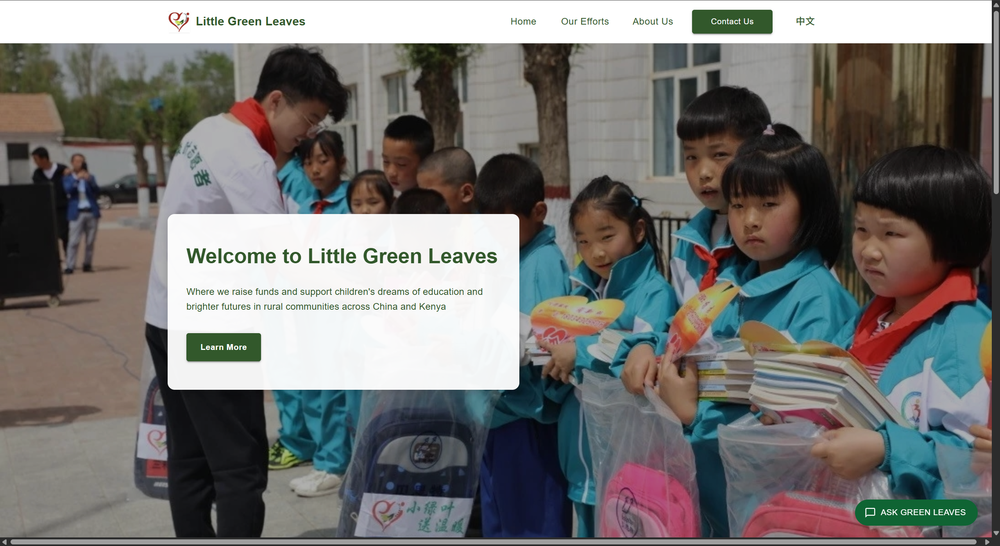
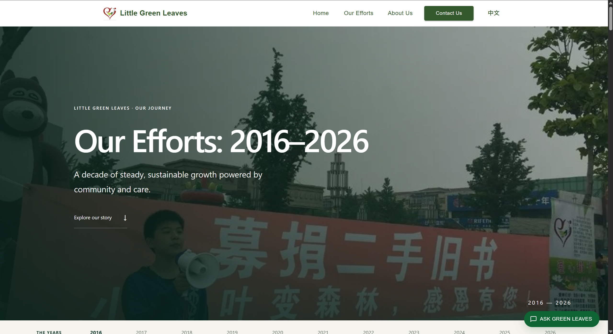
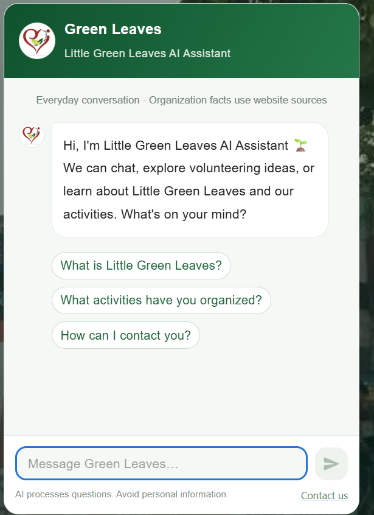
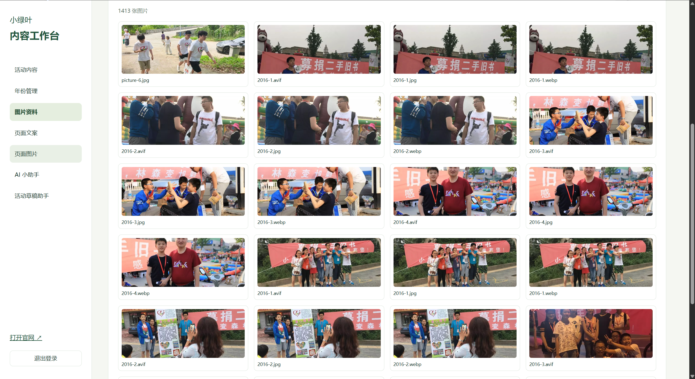
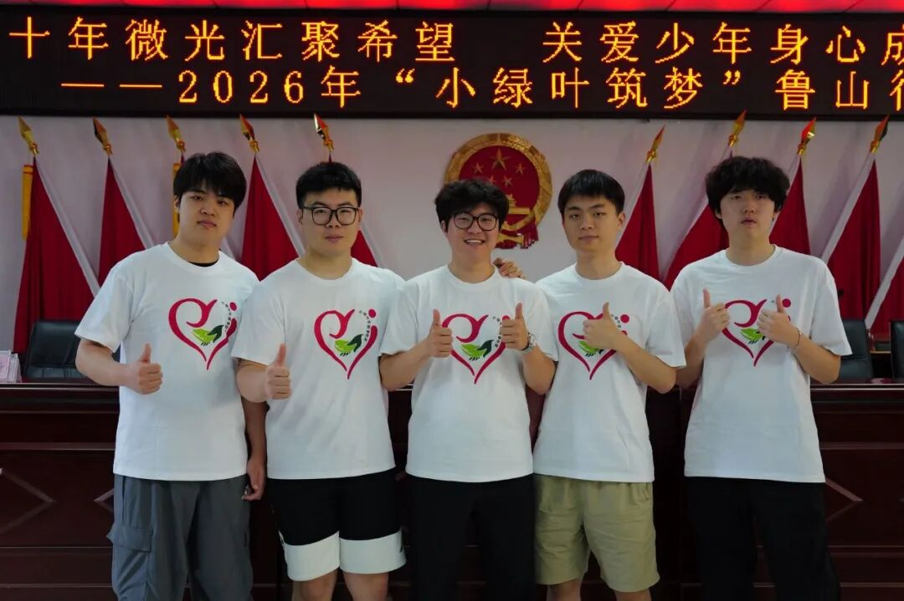

# 🌱 Little Green Leaves

**Ten years of small acts of kindness, growing into shared hope.**

The official website of the **Little Green Leaves Volunteer Alliance** — a place to discover our work, explore our stories, and connect with a community committed to supporting children's education and growth.

From book donations and one-to-one sponsorships to winter camps and community visits, the website brings together the people, moments, and continuing relationships behind our work.

**[Visit Our Website](https://little-green-leaves.world/) · [Explore Our Efforts](https://little-green-leaves.world/our-efforts) · [Get in Touch](https://little-green-leaves.world/contact)**

## Our Story

Little Green Leaves connects people who want to help with children and families who need support. Our work is about more than a single donation or visit: it is about showing up, listening, and building lasting connections.

This website preserves that journey. Each story offers a closer look at an activity, the people who made it possible, and the care that continues beyond the event itself.

## Features

### A Journey Through the Years

Explore our work from **2016 to 2026** through a photo-led timeline.

A persistent year navigation makes it easy to move between chapters. Each year introduces its stories through photographs, a short overview, and individual articles with full text and images.

Historical accounts retain their original context and figures, allowing readers to understand each activity on its own terms.

### Chinese and English Content

Visitors can switch between Chinese and English across the website, including organization information and activity stories.

Content is maintained in both languages. Where a requested translation is missing, English provides a fallback so visitors can continue exploring.

### Meet the Organization

The homepage, About Us, and Contact Us pages introduce our mission, people, and ways to connect.

Together with the activity archive, these pages help visitors understand what Little Green Leaves does, how our work has developed, and where to start a conversation with the team.

### Little Green Leaves AI Assistant

Our AI assistant is available across all public website pages, offering a friendly way to explore Little Green Leaves or simply start a conversation.

Visitors can:

- Say hello and ask general questions.
- Explore volunteering ideas and everyday topics.
- Ask about published activities and organization information.
- Follow source links to read the website material behind an answer.
- Continue a conversation while navigating between public pages.

The assistant introduces itself as AI. General suggestions are not organizational commitments, and website-related answers use published content as their reference. Responses may contain mistakes, so readers can check the linked sources or contact the team.

### A Visual Content Workspace

The administration workspace lets collaborators maintain the website without editing page code.

It supports:

- Creating and editing yearly chapters and activity articles.
- Managing Chinese and English titles and text.
- Arranging subtitles, paragraphs, and images.
- Uploading images and editing captions and alternative text.
- Updating website copy and page imagery.
- Previewing articles in both languages.

This keeps everyday editorial work close to the content itself, making it easier for collaborators with different technical backgrounds to contribute.

### Drafts, Review, and Version History

Content can be prepared privately before it appears on the public website.

Editors can save drafts, preview changes, publish finished articles, and archive older content. Editing an already published article preserves its public version until the new version is explicitly published.

Version history allows editors to review earlier content and restore a previous version as a draft.

### AI-Assisted Content Preparation

The editorial AI assistant helps organize activity notes and imported text into structured bilingual suggestions.

Suggestions can include titles, paragraphs, subtitles, and image descriptions, together with warnings about uncertain dates, conflicting figures, or information requiring privacy review.

**AI suggestions never publish themselves.** An administrator must review and accept a suggestion to create a draft, then publish it through a separate action.

### Published Content, Consistent Across the Website

A shared content backend provides the website's published articles, translations, and editable page content.

Public interfaces keep drafts separate from released material. The timeline also retains a built-in fallback for temporary API outages, helping visitors continue browsing existing stories when the content service is unavailable.

## Care Behind Every Story

Our stories involve real children, families, volunteers, and supporters. Preparing them for publication includes checking facts, preserving the meaning of the original account, and reviewing images and personal information with care.

AI can help organize the work, but people remain responsible for editorial decisions and publication.

## Stay Connected

Discover our activities, share your thoughts, or reach out about ways to support the journey.

**[Explore Little Green Leaves](https://little-green-leaves.world/) · [Contact the Team](https://little-green-leaves.world/contact)**

**Every small green leaf deserves a chance to grow toward the sun.**
